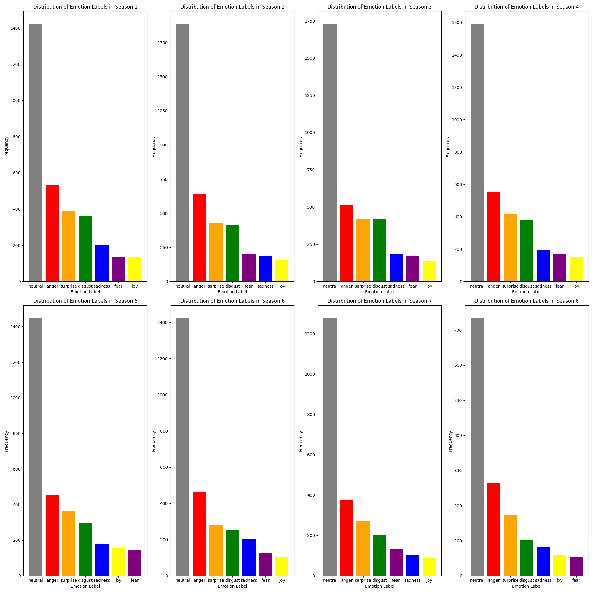
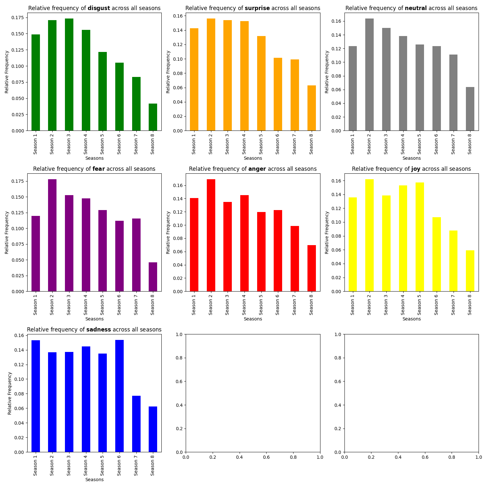
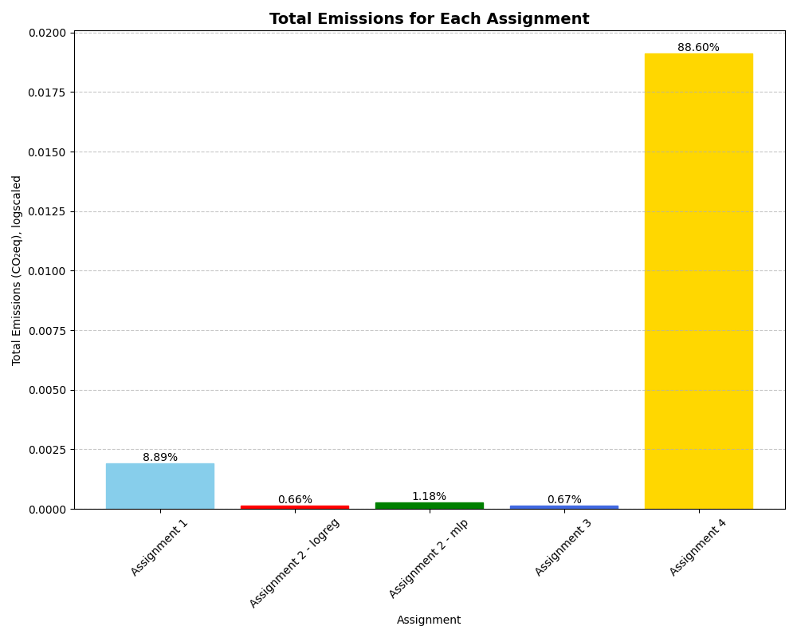
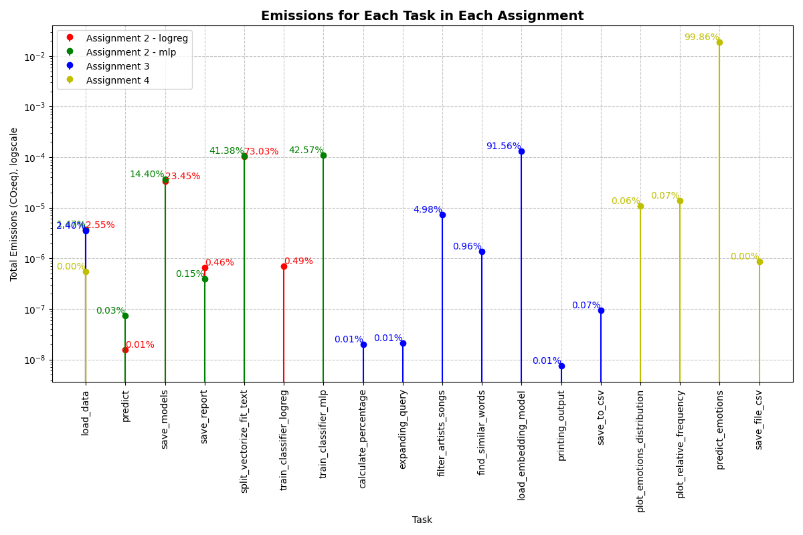

# Language Analytics Portfolio (Assignments 1-5)
**Course**: Language Analytics
 
**Author**: Sabrina Zaki Hansen
**Github-link**: https://github.com/sabszh/cds_la/

## Table of Contents
- [Assignment 1: Extracting linguistic features using spaCy](#assignment-1-extracting-linguistic-features-using-spacy)
  - [Data Source](#data-source)
  - [Requirements](#requirements)
  - [Usage](#usage)
  - [Script Overview](#script-overview)
    - [Functions](#functions)
    - [Carbon Emission Tracking Integration](#carbon-emission-tracking-integration)
    - [Main Functionality](#main-functionality)
  - [Output Summary](#output-summary)
  - [Discussion of Limitations and Possible Steps to Improvement](#discussion-of-limitations-and-possible-steps-to-improvement)
  - [CodeCarbon Tracking](#codecarbon-tracking)
  - [File Structure](#file-structure)
- [Assignment 2: Text classification benchmarks](#assignment-2-text-classification-benchmarks)
  - [Data Source](#data-source-1)
  - [Requirements](#requirements-1)
  - [Usage](#usage-1)
  - [Script Overview](#script-overview-1)
    - [Command-line Arguments](#command-line-arguments)
    - [Functions](#functions-1)
    - [Carbon Emission Tracker Integration](#carbon-emission-tracker-integration)
    - [Main Functionality](#main-functionality-1)
  - [Output Summary](#output-summary-1)
  - [Discussion of Limitations and Possible Steps to Improvement](#discussion-of-limitations-and-possible-steps-to-improvement-1)
  - [CodeCarbon Tracking](#codecarbon-tracking-1)
  - [File Structure](#file-structure-1)
- [Assignment 3: Query Expansion with Word Embeddings](#assignment-3-query-expansion-with-word-embeddings)
  - [Data Source](#data-source-2)
  - [Requirements](#requirements-2)
  - [Usage](#usage-2)
  - [Example](#example)
  - [Script Overview](#script-overview-2)
    - [Command-line Arguments](#command-line-arguments-1)
    - [Functions](#functions-2)
    - [Carbon Emission Tracking Integration](#carbon-emission-tracking-integration-1)
    - [Main Functionality](#main-functionality-2)
  - [Output Summary](#output-summary-2)
  - [Discussion of Limitations and Possible Steps to Improvement](#discussion-of-limitations-and-possible-steps-to-improvement-2)
  - [File Structure](#file-structure-2)
- [Assignment 4: Emotion analysis with pretrained language models](#assignment-4-emotion-analysis-with-pretrained-language-models)
  - [Data Source](#data-source-3)
  - [Requirements](#requirements-3)
  - [Usage](#usage-3)
  - [Script Overview](#script-overview-3)
    - [Functions](#functions-3)
    - [Carbon Emission Tracking Integration](#carbon-emission-tracking-integration-2)
    - [Main Functionality](#main-functionality-3)
  - [Output Summary](#output-summary-3)
  - [Discussion of Limitations and Possible Steps to Improvement](#discussion-of-limitations-and-possible-steps-to-improvement-3)
  - [Repository Structure](#repository-structure)
- [Assignment 5: Evaluating Environmental Impact of Exam Portfolio](#assignment-5-evaluating-environmental-impact-of-exam-portfolio)
  - [Assignment Description](#assignment-description)
  - [Methodology](#methodology)
  - [Replication](#replication)
  - [Results](#results)
    - [Figure 1: Total Emissions](#figure-1-total-emissions)
    - [Figure: Task Emissions](#figure-task-emissions)
    - [Robustness of Results and Discussion](#robustness-of-results-and-discussion)
  - [Repository Contents](#repository-contents)

## Assignment 1: Extracting linguistic features using spaCy
This script extracts linguistic features from the USEcorpus. It extracts Part-of-Speech (POS) tags and named entities using spaCy and saves the output as CSV files for each subfolder in the chosen dataset. It also tracks carbon emission.

### Data Source
The corpus used for this analysis is: *The Uppsala Student English Corpus (USE)*. You can access more documentation via [this link](https://ota.bodleian.ox.ac.uk/repository/xmlui/handle/20.500.12024/2457).

USE was set up with the aim of creating a powerful tool for research into the process and results of foreign language teaching and acquisition, as manifest in the written English of Swedish university students.

#### Contents
The corpus consists of 1,489 essays written by 440 Swedish university students of English at three different levels. The essays cover set topics of different types.

**First-term essays:**
- Evaluation (a1): Students describe their experience of the English language, evaluating their reading, writing, speaking, and listening proficiency. Personal, involved style.
- Argumentation (a2): Students argue for or against a statement concerning a topical issue. Formal style.
Reflections (a3): Students reflect on the medium of television and its impact on people, or on related issues of their choice. Personal/formal style.
- Literature course assignment (a4): Students choose between a discussion of theme/character/narrator and a close-reading based analysis of a set passage. Formal style.
- Culture course assignment (a5): Students study topics in set secondary sources and compose an essay using this material, often quoting and listing these sources.

**Second-term essays:**
- Causal analysis (b1): Students discuss causes of some recent trend of their choice. Formal style.
- Argumentation (b2): Students present counter-arguments to views expressed in articles or letters to the editor. Similar in approach and tone to essay a1.
- Short papers in English linguistics (b3): Academic style.
- English literature (b4): Discussion of character, theme etc., produced in a survey course, dealing with Shakespeare’s Julius Ceasar or contemporary novels.
- American literature (b5): Similar to b4.

**Third-term essays:**
- Literature course essays (c1): Longer essays, all literature course assignments.

### Requirements
- Python > 3.10.12
- `pandas` library
- `spacy` library
- `codecarbon` library
- `setuptools` library
- `en_core_web_md` model for spaCy (downloadable using `python -m spacy download en_core_web_md`)

### Usage
To use this script, follow these steps:

1. Clone or download the repository and make sure you have the file structure as pointed out, and the needed files stored in `in`

2. Set up a virtual environment and install the required packages by running:
    ```
    bash setup.sh
    ```

3. Run the script by executing:
    ```
    bash run.sh
    ```

### Script overview
This Python script, designed for extracting linguistic features using spaCy, facilitates text processing and analysis. IBelow is a breakdown of its functionalities:

#### Functions
1. **`cleaning_text(text)`**: Cleans the input text by removing HTML tags.
2. **`processing_text(file_path)`**: Processes the text file located at the given file path and extracts linguistic features, including the relative frequency of POS tags and counts of unique entities.
3. **`main()`**: The main function orchestrates the execution of the script. It iterates over directories containing text files, processes each file to extract linguistic features, and saves the results to CSV files.

#### Carbon Emission Tracking Integration

The script integrates the Carbon Emission Tracker library to monitor and track carbon emissions during the execution of linguistic feature extraction tasks. It includes the following functionality:

- Initializes the tracker with project details for each assignment folder.
- Starts tracking emissions for each assignment folder.
- Stops tracking emissions after completing processing for each assignment folder.
- Saves emission data to a CSV file for further analysis.

#### Main Functionality
The main function of the script performs the following steps:
1. Creates an output directory if it does not exist.
2. Processes text files located in subfolders of the input directory (`in/USEcorpus`).
3. Extracts linguistic features from each text file and saves the results to CSV files.
4. Prints progress messages indicating the completion of processing for each assignment folder.

### Output Summary
Processed data is saved as CSV files in the `out` directory. Each file is for each folder  It contains the followiing columns:
- Filename: The name of the text file being processed.
- Relative Frequency of NOUN: The relative frequency of nouns in the text.
- Relative Frequency of VERB: The relative frequency of verbs in the text.
- Relative Frequency of ADJ: The relative frequency of adjectives in the text.
- Relative Frequency of ADV: The relative frequency of adverbs in the text.
- Unique PER: The count of unique person entities detected in the text.
- Unique LOC: The count of unique location entities detected in the text.
- Unique ORG: The count of unique organization entities detected in the text.

Overall the outputs do not give much insight, but the results are ready to be shared or used for future analysis.
Moreover, the folder also contains output from CodeCarbon emission tracking `emissions.csv`.

### Discussion of Limitations and Possible Steps to Improvement
The linguistic patterns and characteristics present in the USE corpus may differ significantly from a general English language corpora. Thus, the generic nature of the linguistic feature extraction script may not fully capture the unique linguistic nuances and challenges exhibited by data of Swedish learner of English. Esspecially as the the data is from different times and different styles. Simply plotting the different features for each essay type could bring insight to linguistic differences, and by further qualitative expection bring clarity to whether it is due to model ineffecenicy of linguistic differences across the essays. 

Moreover, this script relies on spaCy and its English model (`en_core_web_md`), impacting linguistic feature extraction accuracy. Entity recognition precision is affected by text quality and model relevance, potentially leading to affecting the performance.

Improvements could involve adopting a larger or domain-specific model to improve accuracy, though this would still be with possible trade-offs. Optimizing code efficiency for processing large text volumes, through parallel processing or algorithmic improvements, is also beneficial. 

### CodeCarbon Tracking
To track emissions, the script utilizes CodeCarbon. Emission data for each task is recorded in a CSV file named `emissions.csv` located in the `out` directory.

For a more detailed analysis of these results, please see Assignment 5.

### File Structure
The script assumes the following directory structure:

```
.
A1/
│
├── in/
│   └── USEcorpus/
│       ├── a1/
│       │   ├── 0100.a1.txt
│       │   └── ...
│       ├── a2/
│       └── ...    
│
├── out/
│   ├── a1_linguistic_features.csv
│   ├── a2_linguistic_features.csv
│   ├── ...
│   └── emissions.csv
│
├── src/
│   └── extract_features.py
│
├── README.md
├── requirements.txt
├── run.sh
└── setup.sh
```

## Assignment 2: Text classification benchmarks

This project involves training a classifier on a dataset to classify news articles as either real or fake. The script contains functions for data processing, model training, and saving trained models, classification reports and carbon emission tracking.

### Data Source
The data used in this analysis can be accesed via [this link](https://www.kaggle.com/datasets/jillanisofttech/fake-or-real-news). The data contains 3 columns: `title`, `text`, `label` (FAKE/REAL).

### Requirements
- Python > 3.10.12
- `codecarbon` library
- `setuptools` library
- `joblib` library
- `pandas` library
- `scikit_learn` library

### Usage
To use this script, follow these steps:

1. Clone or download the repository and make sure you have the file structure as pointed out, and the needed files stored in `in`

2. Set up a virtual environment and install the required packages by running:
    ```
    bash setup.sh
    ```

3. Run the script by executing:
    ```
    bash run.sh <classifier_type>
    ```
    - `<classifier_type>`: Model to classify with, either 'logreg' for logistic regression or 'mlp' for MLP*.

### Script Overview
This Python script is designed for conducting text classification benchmarks. It utilizes machine learning classifiers: logistic regression and multilayer perceptron (MLP) to train models on text data and evaluate their performance. Below is a brief overview of the functionalities provided by the script:

#### Command-line Arguments
The script accepts the following command-line argument:

- `classifier_type`: Specifies the type of classifier to train, which can be either `'logreg'` for logistic regression or `'mlp'` for MLP classifier.

#### Functions
1. **`parse_arguments()`**: Parses the command-line arguments passed to the script.
2. **`load_data(filename)`**: Loads data from a CSV file.
3. **`split_vectorize_fit_text(data, text_column, label_column, max_features, test_size, ngram_range, lowercase, max_df, min_df)`**: Splits the data into training and testing sets, vectorizes the text data using TF-IDF, and returns the necessary components for training.
4. **`train_classifier(X_train_feats, y_train, classifier_type, random_state, activation, hidden_layer_sizes, max_iter)`**: Trains a classifier on the given features and labels. It supports both logistic regression and MLP classifiers.
5. **`save_models(classifier, vectorizer, output_path, modelname)`**: Saves the trained classifier and vectorizer to disk.
6. **`save_report(y_test, y_pred, output_path)`**: Saves the classification report to a text file.

#### Carbon Emission Tracker Integration
The script integrates the Carbon Emission Tracker library to monitor and track carbon emissions during classification. It includes the following functionality:

- Initializes the tracker with project details.
- Starts tracking emissions for specific tasks (e.g., data loading, model training).
- Stops tracking emissions after completing each task.
- Saves emission data to the specified output directory for further analysis.

#### Main Functionality

The main function of the script orchestrates the entire process:

- It parses command-line arguments to determine the classifier type.
- Loads the data from a CSV file.
- Splits, vectorizes, and fits the text data.
- Trains the specified classifier type.
- Makes predictions on the test data.
- Saves the trained models and classification report to the output directory.

### Output Summary
The output of the text classification benchmarks is presented below for both logistic regression (logreg) and multilayer perceptron (MLP) classifiers.

#### Table 1: For logistic regression (logreg)
```
              precision    recall  f1-score   support

        FAKE       0.89      0.88      0.89       628
        REAL       0.88      0.90      0.89       639

    accuracy                           0.89      1267
   macro avg       0.89      0.89      0.89      1267
weighted avg       0.89      0.89      0.89      1267
```

#### Table 2: For multilayer perceptron (MLP)
```
              precision    recall  f1-score   support

        FAKE       0.90      0.87      0.88       628
        REAL       0.87      0.90      0.89       639

    accuracy                           0.89      1267
   macro avg       0.89      0.89      0.89      1267
weighted avg       0.89      0.89      0.89      1267
```
Both models achieve around 89% accuracy in classifying fake and real news articles. Precision, recall, and F1-score provide insights into how effectively each model identifies true instances and minimizes false positives or negatives. Despite their strong performance, further optimization could address challenges like class imbalance.

### Discussion of Limitations and Possible Steps to Improvement
While the classifiers achieved reasonably high accuracy, there are several limitations and potential areas for improvement: Gaining insights into the nature of the data would be an initial step towards understanding the model's overall performance. The manner in which the fake dataset was generated or collected remains undisclosed, making it challenging to assert the efficacy of the models or evaluate the fidelity of the data representation. Testing the model on another dataset, could be one way to gain further understanding. Additionally, including a separate validation set during model training could provide a more reliable estimate of performance and help prevent overfitting to the training data.

A significant limitation of the benchmark lies in its exclusive reliance on TF-IDF vectorization for feature extraction. This method adopts a bag-of-words approach, which assumes that the occurrence of words in the document is independent of each other, disregarding the contextual relationships between them. This oversimplification may overlook crucial semantic nuances present in the text data, potentially constraining the model's ability to capture complex patterns and meanings.

Moreover, the classifiers' hyperparameters, such as the number of hidden layers and neurons for the MLP classifier, were not extensively tuned. Conducting a thorough hyperparameter search using techniques like grid search or randomized search could yield better-performing and more accurate models.

Taking a further stride, enhancing the interpretability of the models could provide insights into the features driving the predictions. This would make the models useful in terms of understanding the patterns of fake / real news.

### CodeCarbon Tracking
To track emissions, the script utilizes CodeCarbon. Emission data for each task is recorded in a CSV files located in the `out` directory.

For a more detailed analysis of these results, please see Assignment 5.

### File Structure

The project assumes the following directory structure:

```
.
A2/
│
├── in/
│ └── fake_or_real_news.csv
│
├── out/
│ ├── emissions/
│ │  ├── emissions_base_{UUID}.csv ## Check the task_name for which classifier type 
│ │  ├── emissions_base_{UUID}.csv ## As stated above
│ │  └── emissions.csv ## This file should just be ignored
│ ├── models/
│ │  ├── classifier_logreg.joblib
│ │  ├── classifier_mlp.joblib
│ │  └── vectorizer.joblib
│ ├── logreg_report.txt
│ └── mlp_report.txt
│
├── src/
│   └── text_classification.py
│
├── README.md
├── requirements.txt
├── run.sh
└── setup.sh
```

## Assignment 3: Query Expansion with Word Embeddings
This script performs query expansion with word embeddings for song lyrics analysis. It finds similar words to a given search term using a pre-trained word embedding model and then calculates the percentage of songs by a specified artist containing terms from the expanded query.

### Data Source
The song lyrics used for this analysis was obtained from [this dataset](https://www.kaggle.com/datasets/joebeachcapital/57651-spotify-songs). The data contains 4 columns: `artist`, `song`, `link`, `text`.

### Requirements
- Python > 3.10.12
- `gensim` library
- `numpy` library
- `pandas` library
- `codecarbon` library
- `setuptools` library

### Usage
To use this script, follow these steps:

1. Clone or download the repository and make sure you have the file structure as pointed out, and the needed files stored in `in`

2. Set up a virtual environment and install the required packages by running:
    ```
    bash setup.sh
    ```

3. Run the script by executing:
    ```
    bash run.sh <artist> <search_term>
    ```
    - `<"artist">`: Name of the artist to analyze (important: write in quotation)
    - `<"search_term">`: Word to expand the query (important: write in quotation)

### Example
Suppose you want to analyze songs by the artist "Taylor Swift" with the search term "love". You would execute the script as follows:
```
bash run.sh "Taylor Swift" "love"
```

This would analyze the songs in the file, expand the query with similar words to "love", calculate the percentage of Taylor Swift's songs featuring terms related to "love", and save the results to `out/results.csv`.

*Example of output*
```
Output: 
48.27% of Taylor Swift's songs contain words related to love and similar terms.
```

### Script Overview
This Python script is developed for conducting query expansion with word embeddings, primarily for analyzing song lyrics. It uses word embedding models to expand search terms and then assesses the prevalence of those terms in songs by a specified artist. Below is a concise summary of the script's functionalities:

#### Command-line Arguments
The script expects the following command-line arguments:
- `artist`: Name of the artist whose songs will be analyzed.
- `search_term`: The word used as the base for query expansion.

#### Functions
1. **`parse_arguments()`**: Parses the command-line arguments provided to the script.
2. **`load_lyrics(file_path)`**: Loads song lyrics from a file.
3. **`find_similar_words(model, word, top_n=10)`**: Retrieves similar words to a given word using a word embedding model.
4. **`calculate_percentage(artist_songs, expanded_query)`**: Calculates the percentage of songs by the artist featuring terms from the expanded query.
5. **`save_to_csv(output_path, artist, search_term, percentage)`**: Saves analysis results to a CSV file.

#### Carbon Emission Tracking Integration

The script integrates the CodeCarbon library to monitor and track carbon emissions during the analysis process. It includes the following functionality:

- Initializes the tracker with project details.
- Starts tracking emissions for specific tasks (e.g., data loading, model loading).
- Stops tracking emissions after completing each task.
- Saves emission data to the specified output directory for further analysis.

#### Main Functionality

The main function of the script orchestrates the entire process:

- Parses command-line arguments to determine the artist and search term.
- Loads song lyrics from a provided file.
- Loads a pre-trained word embedding model.
- Expands the query term with similar words.
- Filters songs by the specified artist.
- Calculates the percentage of songs containing the expanded query terms.
- Saves analysis results to a CSV file.
- Prints the percentage of relevant songs based on the query expansion.

### Output Summary
The script outputs the percentage of songs by the specified artist containing words related to the search term and similar terms. It also saves the results to a CSV file named `results.csv` in the `out` directory.

#### Table 1: Example of output for results.csv
| Artist         | Search Term | Percentage |
|----------------|--------------|------------|
| Taylor Swift   | love         | 48.27%     |
| Harry Styles   | love         | 11.76%     |
| One Direction  | happy        | 100.0%     |
| Fleetwood Mac  | chain        | 0.54%      |
| The Beatles    | peace        | 0.45%      |
| The Strokes    | reptilia     | 0%         |


### Discussion of Limitations and Possible Steps to Improvement
While the current implementation of the script serves its purpose for query expansion and analysis of song lyrics, there are several limitations and areas for potential improvement.

Firstly, the choice of word embedding model, such as GloVe, may not always capture the nuanced relationships between words effectively. Exploring different word embedding models or training custom embeddings on domain-specific data could potentially enhance the relevance of the expanded terms. Moreover, the absence of a benchmarking or evaluation tool makes it challenging to gauge the performance of the script and/or model accurately.

Additionally, the query expansion strategy employed by the script is relatively simplistic, relying on finding similar words to the given search term. While this approach is effective in many cases, it may overlook context-specific relationships between words. Incorporating more sophisticated query expansion techniques, such as semantic similarity or context-aware embeddings, could lead to more nuanced and relevant expansions. Furthermore, the script does not explicitly address the challenges posed by ambiguous or polysemous words. As a result, the expanded query may include irrelevant or ambiguous terms that could lead to inaccurate analysis results. Incorporating techniques to disambiguate words or considering contextual information could mitigate this issue. Moreover, it would be relevant investigating the impact on the performance of pre-processing the text.

From a computational standpoint, it would be advantageous to create word embeddings of the lyrics data and store the resulting vectors in a vector store for more efficient access. This approach could also facilitate deeper exploration of the lyrics, providing potential insights into patterns within the lyrics and artists.

### CodeCarbon Tracking
To track emissions, the script utilizes CodeCarbon. Emission data for each task is recorded in a CSV files located in the `out` directory.

For a more detailed analysis of these results, please see Assignment 5.

### File Structure
The project assumes the following directory structure:

```
.
A3/
│
├── in/
│ └── Spotify Million Song Dataset_exported.csv
│
├── out/
│ ├── emissions_base_{UUID}.csv
│ ├── emissions.csv ## This file should just be ignored
│ └── results.csv
│
├── src/
│ └── lyrics_analysis.py
│
├── README.md
├── requirements.txt
├── run.sh
└── setup.sh
```

## Assignment 4: Emotion analysis with pretrained language models
This script performs emotion analysis on the scripts of the television show *Game of Thrones*. It predicts emotion scores for each line in the scripts using a pretrained language model, and then analyzes the distribution of emotions across seasons as well as the relative frequency of each emotion label across all seasons.

### Data Source
The data used in this anlysis, can be accesed via [this link](https://www.kaggle.com/datasets/albenft/game-of-thrones-script-all-seasons?select=Game_of_Thrones_Script.csv). The content inside is a complete set of Game of Thrones script for all seasons in form of a table containing 6 columns with different data types used for various purposes. Description on each columns are provided on the data description part.

The dataset has the following: `release date` (original air data of the episode), `season` (season number), `episode` (episode number), `episode title` (title of each episode), `name` (name of character in Game of Thrones), `sentence` (sentence spoken in the series).

### Requirements
- Python > 3.10.12
- `matplotlib` library
- `transformers` library
- `pandas` library
- `codecarbon` library
- `setuptools` library

### Usage
To use this script, follow these steps:

1. Clone or download the repository and make sure you have the file structure as pointed out, and the needed files stored in `in`

2. Set up a virtual environment and install the required packages by running:
    ```
    bash setup.sh
    ```

3. Run the script by executing:
    ```
    bash run.sh
    ```

### Script Overview
This Python script, developed for emotion analysis with a pretrained language model. The pretrained language model used for emotion analysis is from HuggingFace [j-hartmann/emotion-english-distilroberta-base](https://huggingface.co/j-hartmann/emotion-english-distilroberta-base). The script facilitates the prediction and visualization of emotions from Games Of Thrones transcript. Below is a breakdown of its functionalities:

#### Functions
1. **`predict_emotion_scores(data)`**: Predicts emotion scores for each line of textual data using a pretrained language model pipeline and enriches the DataFrame with predicted emotion labels.
2. **`plot_season_emotions(data, output_dir)`**: Plots the distribution of emotion labels for each season of a TV series and saves the plots to the specified output directory.
3. **`plot_relative_emotion_freq(data, output_dir)`**: Plots the relative frequency of each emotion label across all seasons and saves the plot to the specified output directory.
4. **`save_predicted_emotions(data, output_dir)`**: Saves the DataFrame with predicted emotions to a CSV file in the specified output directory.

#### Carbon Emission Tracking Integration
The script integrates the Carbon Emission Tracker library to monitor and track carbon emissions during the execution of emotion analysis tasks. It includes the following functionality:

- Initializes the tracker with project details for emotion analysis.
- Starts tracking emissions for each task.
- Stops tracking emissions after completing each task.
- Saves emission data to the specified output directory for further analysis.

#### Main Functionality
The main function of the script performs the following steps:

1. Checks if a CSV file containing predicted emotions exists. If not, it loads the input data from a CSV file and predicts emotion scores.
2. Saves the predicted emotions to a CSV file if not already present.
3. Plots the distribution of emotion labels for each season and saves the plots.
4. Plots the relative frequency of each emotion label across all seasons and saves the plot.

### Output Summary
#### Figure 1: Histogram of the disturbtion of all emotions in each season


This figure contains a set of histograms showing the distribution of different emotion labels for each season. Each subplot represents a different season, and the x-axis shows different emotions (neutral, anger, surprise, disgust, sadness, fear, joy), while the y-axis indicates the frequency of these emotions. Here are the main observations:

- **Neutral Emotion:** This is the most frequent emotion across all seasons. Its frequency is significantly higher than other emotions.
- **Anger**: The second most common emotion, though its frequency varies slightly across seasons.
- **Other Emotions**: Surprise, disgust, sadness, fear, and joy have relatively lower frequencies and are distributed more evenly across the seasons.
- **Seasonal Variations**: While the overall trend of emotion distribution remains consistent, there are slight variations in the frequencies of emotions like anger, surprise, and joy across different seasons.

#### Figure 2: Relative frequency of emotion across seasons

This figure contains individual bar charts showing the relative frequency of each emotion (disgust, surprise, neutral, fear, anger, joy, and sadness) across all seasons. Each subplot represents a different emotion, and the x-axis lists the seasons, while the y-axis indicates the relative frequency.

- **Disgust**: Peaks in Season 2 and Season 3, with the lowest relative frequency in Season 8.
- **Surprise**: Highest in Season 2, with a general decline towards Season 8.
- **Neutral**: High relative frequency in Season 2, gradually declining in later seasons.
- **Fear**: Highest in Season 2, showing a slight decrease over the seasons.
- **Anger**: Peaks in Season 2, with a gradual decrease over subsequent seasons.
- **Joy**: Highest relative frequency in Season 4, with noticeable drops in Seasons 7 and 8.
- **Sadness**: Fairly consistent but slightly higher in Season 6, with a drop in Season 8.

Neutral and anger are the most dominant emotions throughout the series. There's a noticeable peak in emotions like anger, surprise, and disgust in the earlier seasons (especially Season 2), which generally declines in later seasons, particularly in Season 8. Emotions like fear, sadness, and joy remain relatively stable, with only minor fluctuations across seasons.

This analysis suggests that the emotional tone of "Game of Thrones" is heavily dominated by neutral and anger emotions, with significant shifts occurring around Season 2 and a general decline in intense emotions by the final season.

### Discussion of Limitations and Possible Steps to Improvement
While the script offers valuable insights into emotion analysis using pretrained language models, it also exhibits certain limitations that could affect its performance.

One significant limitation is the reliance on a single pretrained language model for emotion classification. The choice of model may influence the accuracy and robustness of emotion predictions, potentially leading to biases or inaccuracies in the results. To address this limitation, future iterations of the script could incorporate an ensemble of multiple models or allow users to specify different pretrained models for comparison and evaluation.

Another potential limitation lies in the training data used to develop the pretrained language model for emotion classification. If the training data is biased or limited in scope, it may not adequately capture the complexity and diversity of emotions present in real-world text data. To mitigate this limitation, researchers could explore strategies for curating diverse and representative training datasets, incorporating data augmentation techniques, or fine-tuning pretrained models on domain-specific text corpora relevant to the application domain.

Additionally, the script's reliance on text data alone for emotion analysis may overlook important contextual cues or non-verbal signals that contribute to understanding emotions in natural language. Incorporating multimodal inputs, such as audio, video, or physiological data, could enhance the accuracy and granularity of emotion predictions, particularly in multimedia environments.

Furthermore, the current implementation of the script focuses primarily on static analysis of emotion distributions across seasons or episodes of a TV series. To provide more dynamic and actionable insights, future versions of the script could incorporate temporal analysis techniques, sentiment trend analysis, or sentiment tracking over time to capture evolving emotional dynamics and narrative arcs within the text data.

Overall, while the script represents a promising approach to emotion analysis of the transcript with pretrained language models, addressing these limitations and implementing steps for improvement could enhance its effectiveness, reliability, and relevance in various real-world applications.

### Repository Structure
Ensure that your repository follows the structure outlined below:
```
.
A4/
│
├── in/
│   └── Game_of_Thrones_Script.csv
│
├── out/
│   ├── all_seasons_emotions.png
│   ├── emissions_base_{UUID}.csv
│   ├── emissions.csv ## This file should just be ignored
│   ├── predicted_emotions.csv
│   └── relative_emotion_frequency.png
│
├── src/
│   └── emotion_analysis.py
│
├── README.md
├── requirements.txt
├── run.sh
└── setup.sh
```

## Assignment 5: Evaluating Environmental Impact of Exam Portfolio

### Assignment Description
This assignment evaluates the environmental impact of the work completed in the portfolio for Cultural Data Science, Language Analytics course. CodeCarbon, a tool that measures the CO₂ emissions of code, is utilized to assess the environmental footprint of the assignments. The main focus is to determine which assignments and tasks have contributed the most to CO₂ emissions and to discuss the implications of these findings.

### Methodology
1. **Data Collection**: Data was collected from each assignment in the Language Analytics course, including A1, A2, A3, and A4.
2. **CO₂ Emissions Measurement**: CodeCarbon was used to measure the CO₂ emissions generated by the code in each assignment.
3. **Analysis**: The results were analyzed to identify the assignment and tasks that generated the most emissions. The robustness of these findings was also assessed, and potential areas for improvement were discussed.

## Replication
To replicate the output, follow these steps:

1. Clone or download the repository and make sure you have the file structure as pointed out, and the needed emissions files stored in `in`

2. Set up a virtual environment and install the required packages by running:
    ```
    bash setup.sh
    ```

3. Run the script by executing:
    ```
    bash run.sh
    ```


### Results
#### Figure 1: Total Emissions


Assignment 4 (Emotion analysis with pretrained language model) generated the highest emissions in terms of CO₂eq. The emission was equal to 88.60% of the total generated emission across all assignments. 

#### Figure: Task Emissions


The task on predicting emotions in assignment 4 was the one producing most emissions - namely 99.86%. 

N.B: Assignment 1 was not included in this analysis, as the script was not built in such a way that was suitable for tracking task emissions. Assignment 2 has been tracked for the two different methods, logistic regression and MLP.

#### Robustness of Results and Discussion
CodeCarbon is a useful tool, but there are several ways to enhance its functionalities further.

One area for improvement is the static nature of its carbon measures, which currently vary only by country and do not reflect real-time changes. In reality, energy sources fluctuate as some sources come online or go offline (e.g., solar power, wind power etc.). For instance, comparing carbon emissions in Denmark to a less green country might not be accurate, given Denmark's substantial reliance on renewable energy. CodeCarbon could be improved by tracking these real-time changes in the energy mix, providing more accurate estimates. Additionally, it could offer recommendations for when to run non-urgent models to take advantage of greener energy availability.

Another limitation is the lack of granularity in task-level emissions measurement, besides the ones done manually - it could be linked to the functionationalties run in the script. Enhancements could include more refined measurements to pinpoint specific areas where the code could be optimized for better energy efficiency.

For example, the analysis revealed that Assignment 4 caused the most emissions. A closer look into task-level emissions showed that the prediction of emotions was particularly resource-intensive. This aligns with expectations, as this task involved running a pre-trained classifier by HuggingFace on a substantial amount of text data. Improving granularity in emissions tracking would help identify such high-load tasks, allowing to target specific areas for optimization within the task. 

Other general observations indicate that data loading is not a significant source of emissions. The primary contributors to emissions are tasks involving model usage, such as vectorizing (as seen in both parts of Assignment 2), training classifiers (specifically the MLP classifier in Assignment 2), and loading embedding models (as in Assignment 3). 

This observation highlights the considerable environmental impact of using language models and AI. The computational intensity required for these processes translates directly into higher carbon emissions. Given the increasing reliance on AI and machine learning across various fields, it is crucial to consider their environmental footprint. Optimizing these processes or finding more energy-efficient alternatives could significantly reduce their ecological impact.

Reflecting on these findings, it becomes evident that developers and researchers should prioritize efficiency and sustainability when designing and deploying AI models. By doing so, they can contribute to reducing the overall carbon footprint of their computational activities, fostering a more sustainable approach to technological advancement.

### Repository Contents
- **CSV Files**: Contains the CO₂ emissions data generated by CodeCarbon for each assignment.
- **Output Folder**: Contains the plots generated of the emissions.
- **Script**: Contains code for generaiting the plots. 
