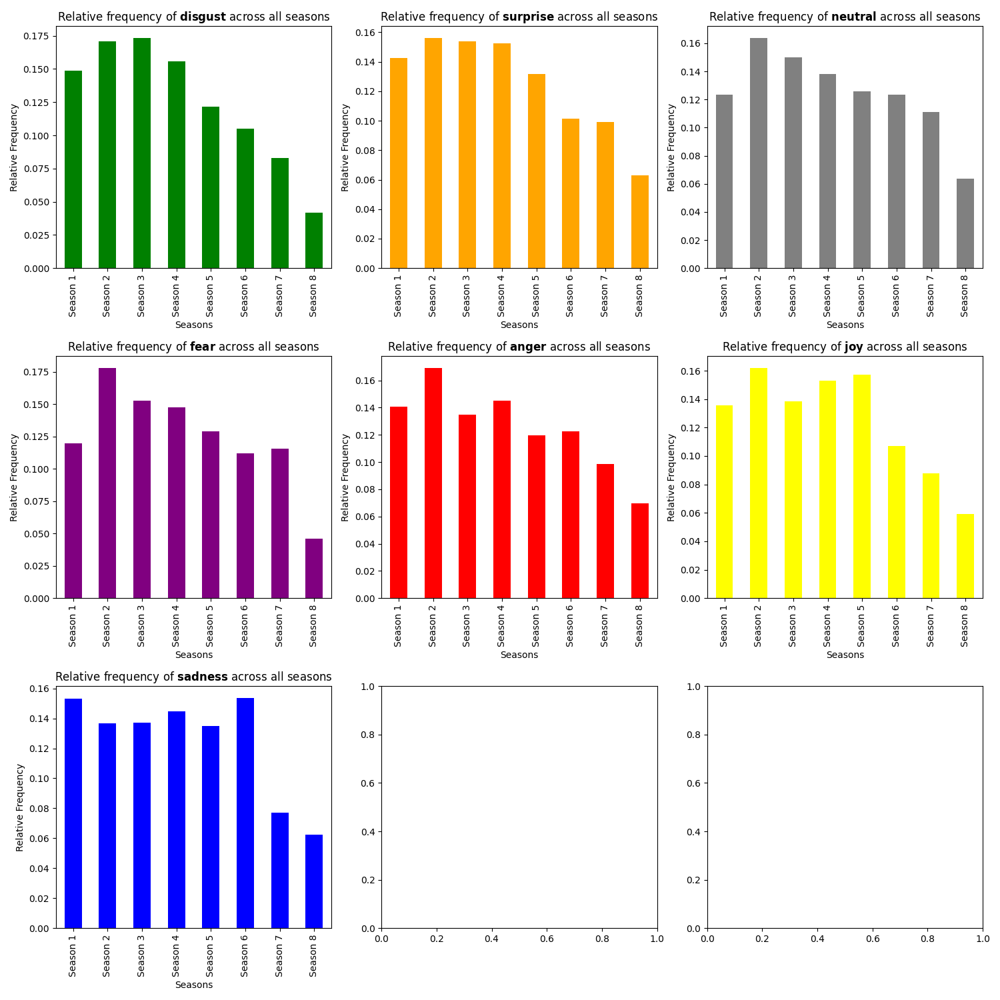

# Assignment 4 - Emotion analysis with pretrained language models
This script performs emotion analysis on the scripts of the television show *Game of Thrones*. It predicts emotion scores for each line in the scripts using a pretrained language model, and then analyzes the distribution of emotions across seasons as well as the relative frequency of each emotion label across all seasons.

## Data Source
The data used in this anlysis, can be accesed via [this link](https://www.kaggle.com/datasets/albenft/game-of-thrones-script-all-seasons?select=Game_of_Thrones_Script.csv). The content inside is a complete set of Game of Thrones script for all seasons in form of a table containing 6 columns with different data types used for various purposes. Description on each columns are provided on the data description part.

The dataset has the following: `release date` (original air data of the episode), `season` (season number), `episode` (episode number), `episode title` (title of each episode), `name` (name of character in Game of Thrones), `sentence` (sentence spoken in the series).

## Requirements
- Python > 3.10.12
- `matplotlib` library
- `transformers` library
- `pandas` library
- `codecarbon` library

## Usage
To use this script, follow these steps:
1. Clone or download the repository.

2. Set up a virtual environment and install the required packages by running:
    ```
    bash setup.sh
    ```

3. Run the script by executing:
    ```
    bash run.sh
    ```

## Script Overview
This Python script, developed for emotion analysis with a pretrained language model. The pretrained language model used for emotion analysis is from HuggingFace [j-hartmann/emotion-english-distilroberta-base](https://huggingface.co/j-hartmann/emotion-english-distilroberta-base). The script facilitates the prediction and visualization of emotions from Games Of Thrones transcript. Below is a breakdown of its functionalities:

### Functions
1. **`predict_emotion_scores(data)`**: Predicts emotion scores for each line of textual data using a pretrained language model pipeline and enriches the DataFrame with predicted emotion labels.
2. **`plot_season_emotions(data, output_dir)`**: Plots the distribution of emotion labels for each season of a TV series and saves the plots to the specified output directory.
3. **`plot_relative_emotion_freq(data, output_dir)`**: Plots the relative frequency of each emotion label across all seasons and saves the plot to the specified output directory.
4. **`save_predicted_emotions(data, output_dir)`**: Saves the DataFrame with predicted emotions to a CSV file in the specified output directory.

### Carbon Emission Tracking Integration
The script integrates the Carbon Emission Tracker library to monitor and track carbon emissions during the execution of emotion analysis tasks. It includes the following functionality:

- Initializes the tracker with project details for emotion analysis.
- Starts tracking emissions for each task.
- Stops tracking emissions after completing each task.
- Saves emission data to the specified output directory for further analysis.

### Main Functionality
The main function of the script performs the following steps:

1. Checks if a CSV file containing predicted emotions exists. If not, it loads the input data from a CSV file and predicts emotion scores.
2. Saves the predicted emotions to a CSV file if not already present.
3. Plots the distribution of emotion labels for each season and saves the plots.
4. Plots the relative frequency of each emotion label across all seasons and saves the plot.

## Output Summary





## Discussion of Limitations and Possible Steps to Improvement
While the script offers valuable insights into emotion analysis using pretrained language models, it also exhibits certain limitations that could affect its performance.

One significant limitation is the reliance on a single pretrained language model for emotion classification. The choice of model may influence the accuracy and robustness of emotion predictions, potentially leading to biases or inaccuracies in the results. To address this limitation, future iterations of the script could incorporate an ensemble of multiple models or allow users to specify different pretrained models for comparison and evaluation.

Another potential limitation lies in the training data used to develop the pretrained language model for emotion classification. If the training data is biased or limited in scope, it may not adequately capture the complexity and diversity of emotions present in real-world text data. To mitigate this limitation, researchers could explore strategies for curating diverse and representative training datasets, incorporating data augmentation techniques, or fine-tuning pretrained models on domain-specific text corpora relevant to the application domain.

Additionally, the script's reliance on text data alone for emotion analysis may overlook important contextual cues or non-verbal signals that contribute to understanding emotions in natural language. Incorporating multimodal inputs, such as audio, video, or physiological data, could enhance the accuracy and granularity of emotion predictions, particularly in multimedia-rich environments like social media platforms or virtual environments.

Furthermore, the current implementation of the script focuses primarily on static analysis of emotion distributions across seasons or episodes of a TV series. To provide more dynamic and actionable insights, future versions of the script could incorporate temporal analysis techniques, sentiment trend analysis, or sentiment tracking over time to capture evolving emotional dynamics and narrative arcs within the text data.

Lastly, the script's integration of carbon emission tracking offers valuable transparency and accountability in assessing the environmental impact of computational tasks. However, it does not directly address other sustainability considerations, such as energy efficiency optimizations or renewable energy usage. To promote more sustainable computing practices, future iterations of the script could explore energy-efficient model architectures, resource-aware scheduling algorithms, or cloud computing strategies optimized for reducing carbon footprints while maintaining computational performance.

Overall, while the script represents a promising approach to emotion analysis with pretrained language models, addressing these limitations and implementing proactive steps for improvement could enhance its effectiveness, reliability, and relevance in various real-world applications.

investigate charcters impact 

## Repository Structure
Ensure that your repository follows the structure outlined below:
```
.
A4/
│
├── in/
│   └── Game_of_Thrones_Script.csv
│
├── out/
│   ├── all_seasons_emotions.png
│   ├── emissions_base_{UUID}.csv
│   ├── emissions.csv # This file should just be ignored
│   ├── predicted_emotions.csv
│   └── relative_emotion_frequency.png
│
├── src/
│   └── emotion_analysis.py
│
├── README.md
├── requirements.txt
├── run.sh
└── setup.sh
```