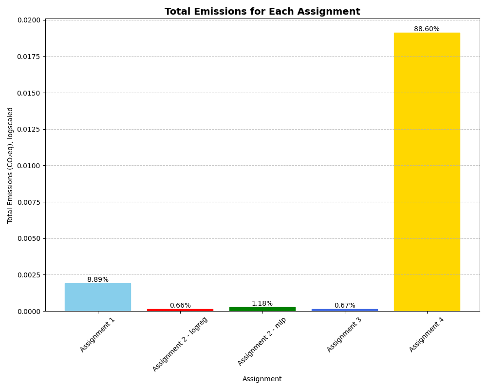
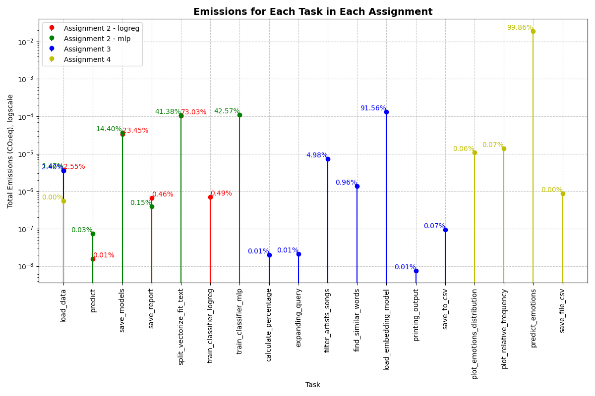

# Assignment 5: Evaluating Environmental Impact of Exam Portfolio

## Assignment Description
This assignment evaluates the environmental impact of the work completed in the portfolio for Cultural Data Science, Language Analytics course. CodeCarbon, a tool that measures the CO₂ emissions of code, is utilized to assess the environmental footprint of the assignments. The main focus is to determine which assignments and tasks have contributed the most to CO₂ emissions and to discuss the implications of these findings.

## Methodology
1. **Data Collection**: Data was collected from each assignment in the Language Analytics course, including A1, A2, A3, and A4.
2. **CO₂ Emissions Measurement**: CodeCarbon was used to measure the CO₂ emissions generated by the code in each assignment.
3. **Analysis**: The results were analyzed to identify the assignment and tasks that generated the most emissions. The robustness of these findings was also assessed, and potential areas for improvement were discussed.

## Replication
To replicate the output, follow these steps:

1. Clone or download the repository and make sure you have the file structure as pointed out, and the needed emissions files stored in `in`

2. Set up a virtual environment and install the required packages by running:
    ```
    bash setup.sh
    ```

3. Run the script by executing:
    ```
    bash run.sh
    ```

## Results
### Figure 1: Total Emissions


Assignment 4 (Emotion analysis with pretrained language model) generated the highest emissions in terms of CO₂eq. The emission was equal to 88.60% of the total generated emission across all assignments. 

### Figure: Task Emissions


The task on predicting emotions in assignment 4 was the one producing most emissions - namely 99.86%. 

N.B: Assignment 1 was not included in this analysis, as the script was not built in such a way that was suitable for tracking task emissions. Assignment 2 has been tracked for the two different methods, logistic regression and MLP.

### Robustness of Results and Discussion
CodeCarbon is a useful tool, but there are several ways to enhance its functionalities further.

One area for improvement is the static nature of its carbon measures, which currently vary only by country and do not reflect real-time changes. In reality, energy sources fluctuate as some sources come online or go offline (e.g., solar power, wind power etc.). For instance, comparing carbon emissions in Denmark to a less green country might not be accurate, given Denmark's substantial reliance on renewable energy. CodeCarbon could be improved by tracking these real-time changes in the energy mix, providing more accurate estimates. Additionally, it could offer recommendations for when to run non-urgent models to take advantage of greener energy availability.

Another limitation is the lack of granularity in task-level emissions measurement, besides the ones done manually - it could be linked to the functionationalties run in the script. Enhancements could include more refined measurements to pinpoint specific areas where the code could be optimized for better energy efficiency.

For example, the analysis revealed that Assignment 4 caused the most emissions. A closer look into task-level emissions showed that the prediction of emotions was particularly resource-intensive. This aligns with expectations, as this task involved running a pre-trained classifier by HuggingFace on a substantial amount of text data. Improving granularity in emissions tracking would help identify such high-load tasks, allowing to target specific areas for optimization within the task. 

Other general observations indicate that data loading is not a significant source of emissions. The primary contributors to emissions are tasks involving model usage, such as vectorizing (as seen in both parts of Assignment 2), training classifiers (specifically the MLP classifier in Assignment 2), and loading embedding models (as in Assignment 3). 

This observation highlights the considerable environmental impact of using language models and AI. The computational intensity required for these processes translates directly into higher carbon emissions. Given the increasing reliance on AI and machine learning across various fields, it is crucial to consider their environmental footprint. Optimizing these processes or finding more energy-efficient alternatives could significantly reduce their ecological impact.

Reflecting on these findings, it becomes evident that developers and researchers should prioritize efficiency and sustainability when designing and deploying AI models. By doing so, they can contribute to reducing the overall carbon footprint of their computational activities, fostering a more sustainable approach to technological advancement.

## Repository Contents
- **CSV Files**: Contains the CO₂ emissions data generated by CodeCarbon for each assignment.
- **Output Folder**: Contains the plots generated of the emissions.
- **Script**: Contains code for generaiting the plots. 
